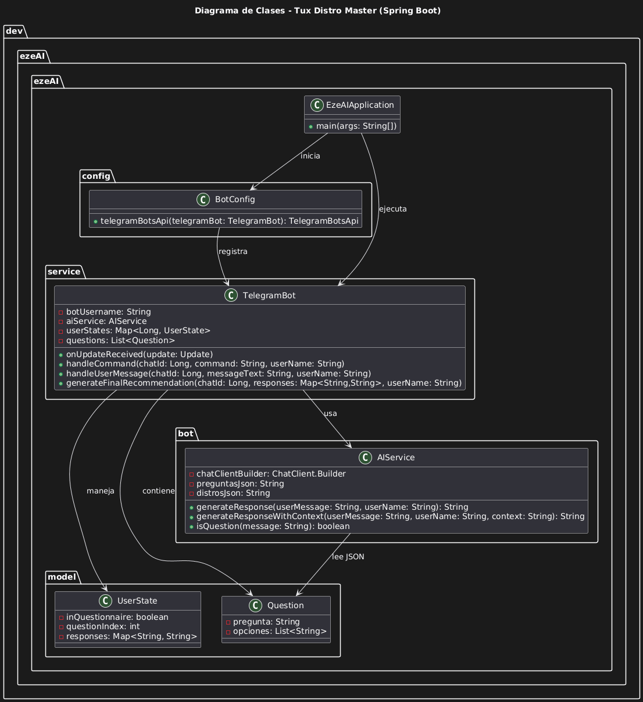

# 🐧 Tux Distro Master — Proyecto Final de Programación II

**Tux Distro Master** es un proyecto desarrollado como **trabajo final para la materia *Programación II*** en la **Facultad de Ingeniería de la Universidad del Norte Santo Tomás de Aquino (UNSTA)**.

Este proyecto tiene como objetivo integrar y aplicar los conocimientos adquiridos en la materia mediante el desarrollo de una aplicación **Spring Boot** funcional, estructurada y mantenible.

> 💡 *Tux Distro Master* combina tecnología, diseño y lógica de programación en un entorno práctico y educativo. Este repositorio contiene un proyecto basado en Spring Boot (Java) junto con soporte para Docker. La finalidad del proyecto es servir como bot ligero o servicio backend, preparado para desplegarse fácilmente. Lenguaje principal: Java (~98%). Incluye también un archivo `Dockerfile` para contenerización.

## Diagrama de Clases

El siguiente diagrama muestra la estructura principal de clases del proyecto, destacando las relaciones entre los componentes clave de la aplicación.



## Estructura del proyecto

* `.mvn/wrapper/`, `mvnw`, `mvnw.cmd` — wrapper de Maven para garantizar compatibilidad en entornos de construcción.
* `pom.xml` — fichero principal de configuración de dependencias y plugins de Maven.
* `src/` — código fuente Java (aplicación Spring Boot).
* `Dockerfile` — configuración para empaquetar la aplicación en un contenedor.
* `.gitignore`, `.gitattributes` — ficheros de control de versiones.

## Requisitos

* Java 21 + (o la versión especificada en `pom.xml`).
* Maven instalado (aunque puede usarse `mvnw` directamente).
* Docker, si deseas crear y ejecutar el contenedor.
* Git para clonar el repositorio.

## Instalación y puesta en marcha

1. Clona este repositorio:

   ```bash
   git clone https://github.com/ezzquielx/tux-distro-master-springboot.git
   cd tux-distro-master-springboot
   ```
2. Construir proyecto con Maven:

   ```bash
   ./mvnw clean package
   ```

   Esto generará el archivo `target/*.jar`.
3. Ejecutar localmente (sin Docker):

   ```bash
   java -jar target/tu-nombre-del-jar.jar
   ```

   Ajusta el puerto si tu aplicación lo requiere.

## Funcionalidades

* Bot o servicio backend ligero construido con Spring Boot.
* Código modular y fácil de extender.
* Posible punto de partida para integraciones, microservicios o automatizaciones.

## Configuración

Revisa y ajusta en `application.properties` o `application.yml` los valores necesarios:

* Puerto de servidor (`server.port`).
* Cadenas de conexión a base de datos (si aplica).
* Claves, tokens o configuraciones de API externas.
* Variables de entorno para producción.

## Despliegue

* Local: ejecutar como jar.
* Contenedor Docker: construir con `Dockerfile` y desplegar en host o en servicio de orquestación (Kubernetes, Docker Swarm, etc.).
* Entorno de producción: configurar variables de entorno, volúmenes, redes, etc. según necesidades.

## Contribuciones

¡Se aceptan mejoras! Si deseas contribuir:

1. Haz un fork del repositorio.
2. Crea una rama (`feature/nueva-funcionalidad`).
3. Haz tus cambios, añade pruebas si conviene.
4. Haz un pull request y espera revisión.
